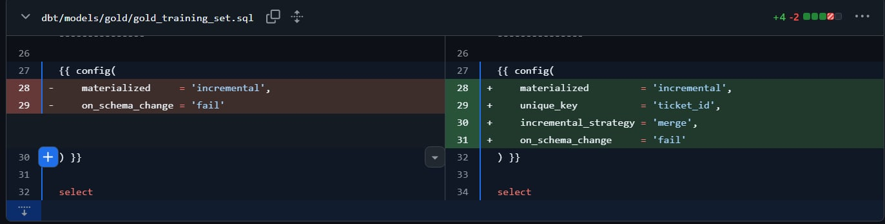
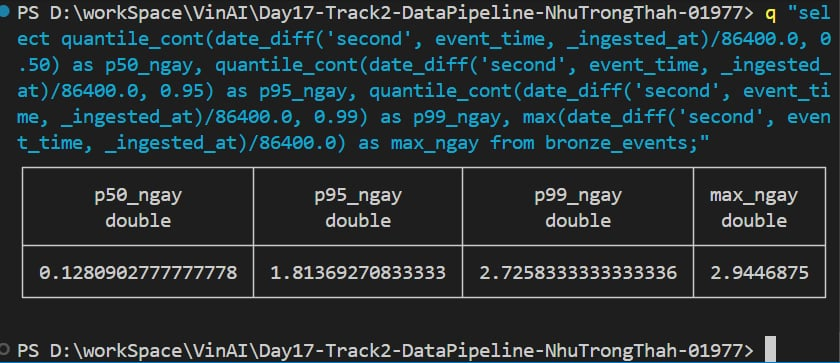
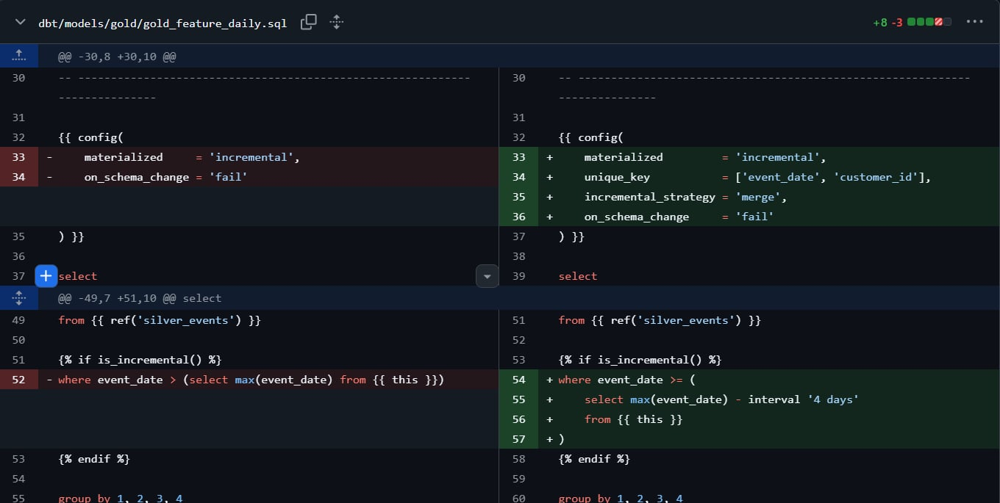
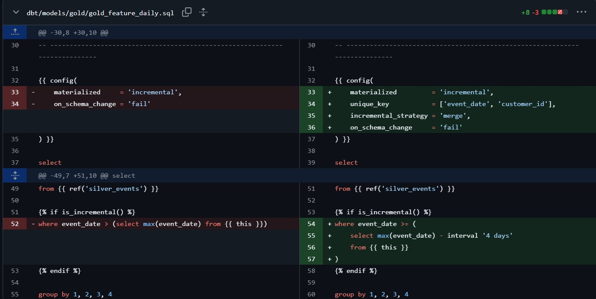
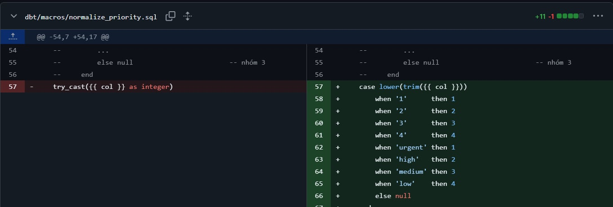
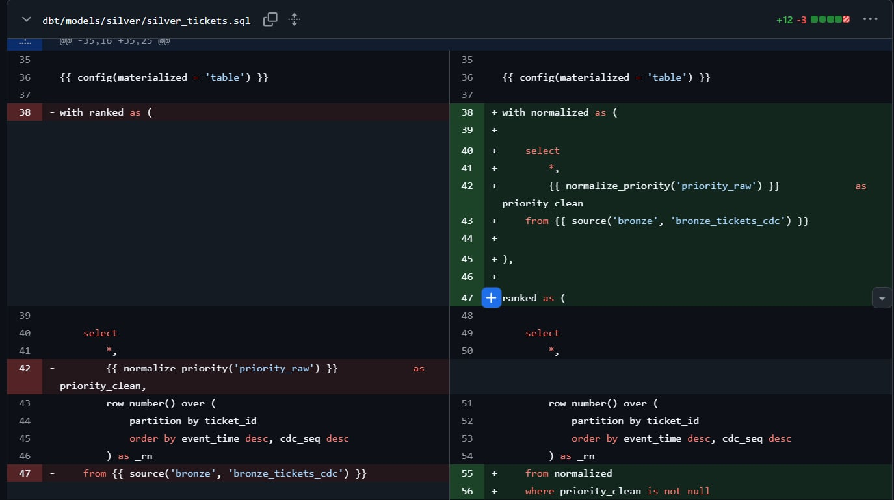
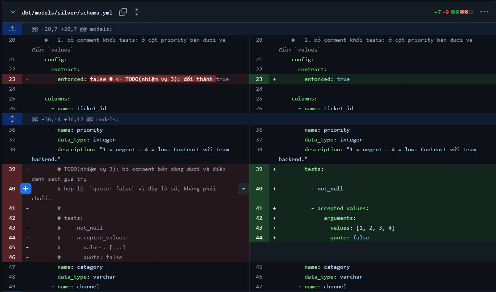
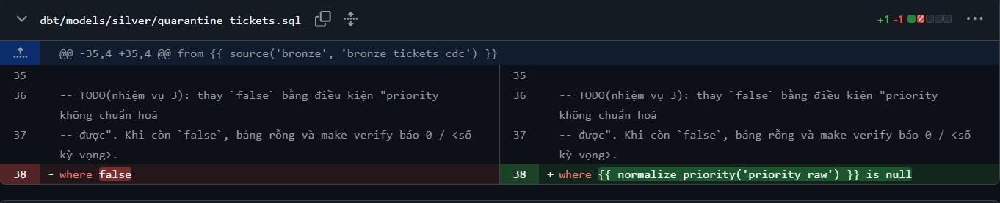

# Báo cáo LAB 17 — Data Pipeline Engineering

Họ tên: Nhữ Trọng Thành | Lớp: AICB-P2T2 | Ngày: 17-08-2026

---

## 0 · Kết quả make verify

Kết quả ba lượt kiểm chứng

~~~
  ━━━━━━━━━━━━━━━━━━━━━━━━━━━━━━━━━━━━━━━━━━━━━━━━━━━━━━━━━━━━━━━━━━━━━━━━━━
  LAB 17 · make verify
  ━━━━━━━━━━━━━━━━━━━━━━━━━━━━━━━━━━━━━━━━━━━━━━━━━━━━━━━━━━━━━━━━━━━━━━━━━━
  run 1/3 … 48.3s
  run 2/3 … 35.5s
  run 3/3 … 36.2s

  BẢNG                  ỔN ĐỊNH          SỐ HÀNG     KỲ VỌNG   GHI CHÚ
  ──────────────────────────────────────────────────────────────────────────
  gold_training_set     ✓ ok              12,480      12,480   ✓
  gold_feature_daily    ✓ ok               9,100       9,100   ✓
  gold_doc_chunks       ✓ ok              31,200      31,200   ✓
  quarantine_tickets    ✓ ok                 312         312   ✓

  CHECKSUM từng lượt
  ──────────────────────────────────────────────────────────────────────────
  gold_training_set     8dd7c98653    8dd7c98653    8dd7c98653   ✓
  gold_feature_daily    3db448685c    3db448685c    3db448685c   ✓
  gold_doc_chunks       92d8e50131    92d8e50131    92d8e50131   ✓
  quarantine_tickets    ebb89036fb    ebb89036fb    ebb89036fb   ✓

  KIỂM TRA KHÁC
  ──────────────────────────────────────────────────────────────────────────
  dbt test                                    ✓ 11/11 pass
  silver_tickets.priority ∈ 1..4, không NULL  ✓ sạch
  quarantine_tickets đúng số bản ghi lỗi      ✓ 312 / 312
  gold_training_set: 1 hàng / 1 ticket        ✓ không lặp
  dashboard rows scanned                      ✓ 5,000,000 → 136,934 (36.5×, cần ≥ 10×)
    số file parquet                           ✓ 5,000 → 14
    kết quả truy vấn không đổi                ✓
  DAG: catchup / max_active_runs              ✓ False / 1

  TỔNG KẾT
  ──────────────────────────────────────────────────────────────────────────
  ✓  1 · gold_training_set idempotent & đúng số hàng
  ✓  2 · gold_feature_daily đủ hàng (dữ liệu về muộn)
  ✓  3 · contract + quarantine + dbt test
  ✓  4 · gold_doc_chunks vẫn ổn định (đối chứng)
  ──────────────────────────────────────────────────────────────────────────
  4/4 tiêu chí đạt
~~~

Tổng kết: 4 / 4 tiêu chí đạt.

---

## 1 · Kích thước bảng training tăng sau mỗi lần chạy

| | |
|---|---|
| Triệu chứng | Sau khi replay pipeline, gold_training_set tăng số dòng mà silverset lại không có thay đổi gì. Ở trạng thái ban đầu, lượt kiểm chứng thứ ba có 38.750 dòng thay vì 12.480 và 12.480 ticket bị lặp. |
| Nguyên nhân | Đây là bảng entity có grain 1 dòng / ticket_id, nhưng model incremental không khai báo unique_key. dbt append kết quả thay vì cập nhật dòng cùng ticket nên dữ liệu bị lặp sau mỗi lần chạy. |
| Cách khắc phục | Trong gold_training_set.sql, đặt unique_key = 'ticket_id' và incremental_strategy = 'merge'. Giữ lọc theo run_date để backfill theo ngày. Trong DAG, đặt catchup=False và max_active_runs=1 để tránh schedule bù và ghi chồng run. |
| Bằng chứng | Trước: 38.750 dòng / 12.480 ticket. Sau: 12.480 dòng / 12.480 ticket, không lặp. Đã thay đổi config DAG để tránh nhiều bên cùng ghi một lúc. |

Minh chứng task 1:

---

## 2 · Bảng đặc trưng theo ngày thiếu hàng ở các ngày quá khứ

| | |
|---|---|
| Triệu chứng | gold_feature_daily ổn định nhưng thiếu dữ liệu lịch sử: 8.645 dòng thay vì 9.100. Các cặp thiếu có event_date cũ nhưng event đến warehouse sau ngày sự kiện. |
| P99 độ trễ đo được | 2,726 ngày. P50 = 0,128 ngày; P95 = 1,814 ngày; max = 2,945 ngày. |
| Lookback đã chọn | 4 ngày. P99 gần 3 ngày nên dùng thêm một ngày lịch để tránh trùng lặp ngày giữa event_time và _ingested_at. |
| Nguyên nhân | Điều kiện incremental chỉ chọn event_date lớn hơn max(event_date) của target. Event đến muộn có ngày xảy ra trong quá khứ không qua được điều kiện này nên không được aggregate lại. |
| Cách khắc phục | Thay điều kiện bằng cửa sổ event_date >= max(event_date) - interval '4 days'. Khai báo unique_key gồm event_date và customer_id, dùng merge để kết quả tính lại ghi đè đúng cặp ngày - customer. |
| Bằng chứng | Trước: 8.645 dòng. Sau: 9.100 dòng. Checksum ba lượt đều là 3db448685c. |

Vì sao chọn P99 làm căn cứ thay vì max? Chi phí của mỗi lựa chọn là gì?

> P99 bao phủ phần lớn dữ liệu đến muộn nhưng không để một ngoại lệ rất hiếm quyết định chi phí của mọi lần chạy sau đó. Lookback dài hơn làm dbt phải aggregate lại nhiều ngày và merge nhiều cặp event_date, customer_id hơn ở mỗi lượt chạy. Nếu dùng max thì chi phí đó lặp lại ở mọi lần chạy.

---

Minh chứng task 2:
chenh_lech_thoi_gia

gold_feature_daily

choose lookback day

## 3 · Kiểu dữ liệu cột priority thay đổi giữa chu kỳ

| | |
|---|---|
| Triệu chứng | Sau khi backend đổi priority từ số sang nhãn chữ, silver_tickets.priority có 6.606 giá trị NULL hoặc ngoài miền 1..4. quarantine_tickets ban đầu có 0 dòng. |
| Nguyên nhân | Macro cũ chỉ try_cast sang integer. Nó biến urgent, high, medium, low thành NULL, nhưng lại chấp nhận 0, 5, -1 vì chúng vẫn là integer. Contract bị tắt nên output không bị ràng buộc kiểu và miền giá trị. |
| Ba nhóm giá trị priority và cách xử lý | Nhóm 1: 1..4 thì giữ nguyên. Nhóm 2: urgent/high/medium/low map thành 1/2/3/4 vì chỉ đổi cách biểu diễn. Nhóm 3: P1, unknown, 0, 5, -1, rỗng, NULL thì trả NULL và chuyển vào quarantine. |
| Cách khắc phục | Viết macro normalize_priority dùng CASE. Trong silver_tickets, chuẩn hóa và lọc priority_clean is not null trước row_number() để vẫn giữ trạng thái hợp lệ trước đó của ticket. quarantine_tickets lọc cùng macro trả NULL. Bật contract, thêm not_null và accepted_values [1, 2, 3, 4]. |
| Bằng chứng | quarantine_tickets có 312 dòng, checksum ba lượt là ebb89036fb. silver_tickets.priority sạch, dbt test 11/11 pass và Silver vẫn giữ đủ 12.480 ticket. |

Câu hỏi thiết kế: 
1. nên chặn ở tầng Bronze hay Silver? 
2. Vì sao không để pipeline dừng(dbt test fail và dừng cả DAG) khi gặp row lỗi? Cân nhắc quy mô, số row lỗi so với tổng số row hợp lệ.

> 1. Bronze phải giữ payload nguồn nguyên trạng để audit, replay và điều tra nguyên nhân. Chuẩn hóa và kiểm tra contract nên diễn ra ở Silver. 
> 2. Không nên để cả DAG dừng chỉ vì 312 bản ghi CDC lỗi, trong khi hơn 130.000 event và 31.200 chunk hợp lệ vẫn cần được phục vụ. Quarantine tách lỗi ra thành hàng đợi để theo dõi và xử lý lại.

---

Minh chứng task 3:
mapping

silver_ticket:

silver_schema:

quarantine_tickets:

## 4 · Mở rộng

### Bài A · Tối ưu truy vấn dashboard

| | |
|---|---|
| Triệu chứng | Dashboard phải đọc 5.000 file Parquet nhỏ. Phép đo ban đầu ghi nhận 5.000.000 rows scanned trong khi dữ liệu thật chỉ có 130.683 dòng. |
| Nguyên nhân | Dataset cũ không partition nên đường dẫn file không mang thông tin về hai cột lọc customer_name và ngày. Điều kiện strftime(event_time, ...) còn bọc cột trong hàm, khiến engine không dùng được partition pruning và min/max statistics trước khi mở file. |
| Cách khắc phục | tools/compact.py ghi lại dữ liệu thành 14 file partition theo event_date, sắp theo event_date, customer_name, event_time và đặt row group 2.048 dòng. queries/dashboard.sql đọc glob đệ quy với hive_partitioning và dùng điều kiện sargable event_date = date '2026-08-09'. |
| Bằng chứng | Rows scanned giảm từ 5.000.000 xuống 136.934, tương đương 36,5 lần; số file giảm từ 5.000 xuống 14. Rows on disk giữ nguyên 130.683 và result hash giữ nguyên 4379e4c5d9f3. |

Partition theo event_date tạo số thư mục nhỏ và ổn định vì dữ liệu chỉ có 14 ngày. Không partition theo customer_name vì 650 khách hàng sẽ tạo quá nhiều thư mục và file nhỏ. Trong mỗi partition ngày, việc sắp các hàng cùng customer_name nằm gần nhau giúp min/max của row group loại được các vùng không thuộc khách hàng cần tìm.

### Bài B · Consumer gặp sự cố giữa batch

| | |
|---|---|
| Triệu chứng | Thiết kế cũ commit offset trước khi ghi batch. Nếu tiến trình chết ở batch 7, offset đã tiến đến 3.500 nhưng database mới có 3.000 message; khi restart consumer đọc từ 3.500 nên mất vĩnh viễn 500 message. |
| Nguyên nhân | Commit trước, ghi sau tạo semantics at-most-once: message không bị đọc lại nhưng có thể mất nếu sự cố xảy ra giữa hai thao tác. Nếu chỉ đảo thành ghi trước, commit sau với INSERT thuần thì hệ thống chuyển sang at-least-once nhưng batch replay sẽ tạo row trùng. |
| Cách khắc phục | ingest/consumer.py ghi batch trước rồi mới commit offset. event_id được đặt làm primary key và phép ghi dùng ON CONFLICT (event_id) DO UPDATE để replay trở thành idempotent. Mỗi batch được đưa vào DuckDB bằng một INSERT từ các mảng UNNEST. |
| Bằng chứng | make crash-test giết consumer ở batch 7 sau khi database đã ghi batch nhưng offset vẫn là 3.000. Lần restart đọc lại từ đó và ghi 17.000 message; kết quả cuối là 20.000 hàng / 20.000 event_id, không mất, không trùng và C = A. Bài mở rộng B đạt. |

DO NOTHING chỉ bỏ qua message replay nếu event_id đã tồn tại, nên có thể giữ nội dung cũ khi cùng event_id được phát lại với dữ liệu đã sửa. DO UPDATE cập nhật các cột bằng nội dung mới nhất, vừa chống trùng vừa phản ánh thay đổi của message, vì vậy phù hợp hơn cho consumer này.

---

## 5 · Tổng kết

| Nhiệm vụ | Khi tiếp nhận một hệ thống chưa quen, tôi sẽ kiểm tra điều này trước tiên |
|---|---|
| 1 | Xác định grain, natural key và câu SQL incremental thực tế để biết replay sẽ append hay update. |
| 2 | So sánh thời điểm xảy ra với thời điểm đến kho; đo phân bố late arrival trước khi chọn lookback. |
| 3 | Phân biệt schema evolution hợp lệ với dữ liệu lỗi thật; giữ raw ở Bronze, chuẩn hóa và route lỗi ở Silver. |
